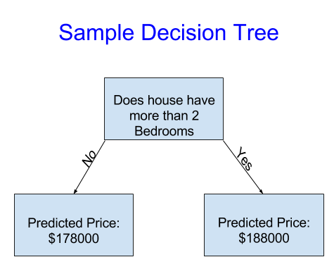
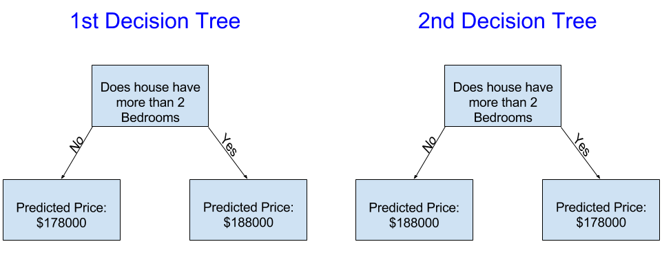

# 🧠 Introduction to Machine Learning

## 🌍 Tổng quan

Trong phần này, chúng ta sẽ tìm hiểu tổng quan về **cách các mô hình Machine Learning hoạt động** và **cách chúng được sử dụng**.  
Nếu bạn đã từng làm việc với mô hình thống kê hoặc Machine Learning trước đó, phần này có thể hơi cơ bản — nhưng yên tâm, ta sẽ sớm tiến đến việc **xây dựng các mô hình mạnh mẽ hơn 💪**.

---

## 💼 Tình huống thực tế

Giả sử bạn có một người anh họ đã **kiếm hàng triệu đô từ việc đầu cơ bất động sản**.  
Anh ấy muốn hợp tác với bạn vì bạn có kỹ năng **Data Science**.  
- Anh ấy sẽ cung cấp vốn 💰  
- Còn bạn sẽ xây dựng **mô hình dự đoán giá trị nhà đất 🏠**

Khi bạn hỏi anh họ cách anh ấy dự đoán giá bất động sản, anh ta bảo đó là “trực giác”.  
Nhưng khi tìm hiểu kỹ hơn, bạn nhận ra anh ta thực ra đang dựa vào **các mẫu (patterns)** đã quan sát từ trước — và dùng chúng để dự đoán giá của các căn nhà mới.

👉 **Machine Learning** cũng hoạt động tương tự như vậy.  
Chúng ta sẽ bắt đầu với một mô hình đơn giản: **Decision Tree (Cây quyết định)**.  
Dù có nhiều mô hình “xịn sò” hơn, nhưng Decision Tree rất dễ hiểu và là **nền tảng của nhiều mô hình mạnh mẽ khác** trong lĩnh vực Data Science.

---

## 🌱 Mô hình Decision Tree đầu tiên

Để đơn giản, ta bắt đầu với **một cây quyết định cực kỳ cơ bản** — nó chia nhà thành **hai nhóm**.  
Giá dự đoán cho mỗi căn nhà sẽ là **giá trung bình lịch sử** của nhóm đó.

- Dữ liệu sẽ được dùng để **quyết định cách chia nhóm**
- Và để **tính giá dự đoán** trong từng nhóm

Quá trình “học” các mẫu từ dữ liệu này gọi là **training (huấn luyện)**.  
Dữ liệu được dùng để huấn luyện mô hình gọi là **training data (dữ liệu huấn luyện)**.

Sau khi mô hình được huấn luyện xong, ta có thể **áp dụng nó lên dữ liệu mới** để dự đoán giá các căn nhà khác.

---

## 🌳 Cải thiện Decision Tree

Hãy xem hai cây quyết định khác nhau được huấn luyện trên cùng bộ dữ liệu bất động sản:  
Cây nào có vẻ hợp lý hơn?

> 💡 **Cây Decision Tree 1** có vẻ hợp lý hơn, vì nó phản ánh thực tế rằng  
> **nhà có nhiều phòng ngủ thường có giá cao hơn** nhà có ít phòng ngủ.

Nhược điểm của mô hình này là nó chưa tính đến nhiều yếu tố khác như:
- Số phòng tắm 🛁  
- Diện tích đất 🌾  
- Vị trí 📍  
- Và nhiều yếu tố khác...

Để mô hình chính xác hơn, ta có thể thêm nhiều “nhánh chia nhỏ” hơn → **cây sâu hơn (deeper tree)**.  
Ví dụ: một cây xét thêm yếu tố **diện tích khu đất** có thể trông như sau:

> **Depth-2 Tree**: mỗi lần chia (split) giúp mô hình hiểu thêm một khía cạnh của dữ liệu.

---

## 🔍 Cách dự đoán

Để dự đoán giá một căn nhà:
1. Bắt đầu từ gốc cây 🌳  
2. Di chuyển theo các nhánh tương ứng với đặc điểm của căn nhà  
3. Tới **lá cây (leaf)** — nơi chứa giá dự đoán 🏁

Các **điểm chia (splits)** và **giá trị ở lá (leaves)** được xác định dựa vào dữ liệu huấn luyện.  
Vì vậy, bước tiếp theo là **khám phá dữ liệu mà bạn sẽ làm việc cùng**.

---

> 🚀 *Tiếp theo: Làm quen với dataset và bắt đầu xây dựng cây quyết định đầu tiên của bạn!*
